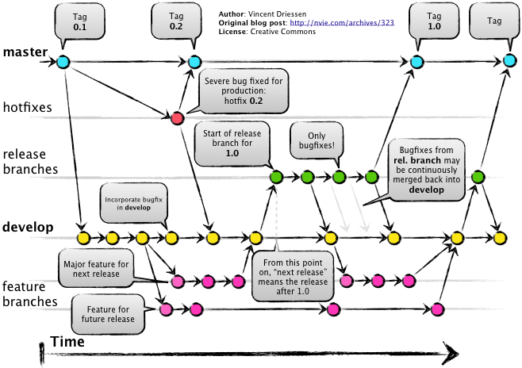

# GitFlow

## Introduction



https://www.atlassian.com/git/tutorials/comparing-workflows/gitflow-workflow

## Branch prefixes

```
Branch name for production releases: [master]
Branch name for "next release" development: [develop]

How to name your supporting branch prefixes?
Feature branches? [feature/]
Bugfix branches? [bugfix/]
Release branches? [release/]
Hotfix branches? [hotfix/]
Support branches? [support/]
Version tag prefix? [] v
```

This is actually the setup step of `git flow init` from GitFlow-AVH
tool (see [Tools](#tools)). Note that we are using a `v` prefix for
tags.

## Support branches

To support previous releases we can use `support` branches.

https://gitversion.readthedocs.io/en/latest/git-branching-strategies/gitflow-examples/#support-branches

With support branches, the `hotfix` branches will be based on
`support` branches instead of `master`.

See also
[this SO question](https://stackoverflow.com/questions/16562339).

**TODO:** We should consider if when fixing several bugs in one
release of `support` branch we possibly need a `release` branch based
on `support`.

## Pull requests

Vanilla GitFlow does not require PR to merge branches, but it can
easily support them, and in Configit.Quote we are using them.

https://blog.axosoft.com/pull-requests-gitflow/ (scroll down to **Pull
requests in a Gitflow model** section)

In pull-request workflow, the `bugfix` branch can be based on:

- `develop`
- `release/` when fixing a bug discovered on a release branch

This is because the _vanilla_ GitFlow assumes working directly on
`release` branch, but we need a temporary `bugfix` branch to make a
pull-request. See also
[this SO question](https://softwareengineering.stackexchange.com/questions/352168).

## Rebasing

[git-flow with rebase](https://ctoinsights.wordpress.com/2012/06/29/git-flow-with-rebase/)

## Tools

### Command-line Git extensions

[GitFlow-AVH](https://github.com/petervanderdoes/gitflow-avh) is a set
of command line tools such as:

- `git flow init` - initializes an existing repository to follow
  GitFlow
- `git flow feature start killer` - creates a new branch
  `features/killer` of `develop` for development of a killer feature
- `git flow feature finish` - merges current feature branch back to
  `develop` and removes the branch (arguably we would not be able to
  use this because of pull-request requirement)
- etc.

### GitVersion

_[GitVersion](https://github.com/GitTools/GitVersion) is a tool to
help you achieve Semantic Versioning on your project._

_GitVersion looks at your git history and works out the semantic
version of the commit being built._

We are using it (supported out of the box in AppVeyor).

Basically a command-line tool that looks at Git history and build-time
patches AssemblyInfo.cs files and/or emits variables understood by the
build service (AppVeyor) to set build numbers.

### Visual Studio plugin

### GUI Clients

Various GUI clients support GitFlow, including GitKraken, SourceTree
and more.

## Pros

- no code freeze
- stabilization (bugfixing) and testing on a release branch, without
  disturbing other development
- popular, well defined and field-tested workflow (lots of resources
  online, chance that new developers already know it)
- tools support (GitVersion being a big one here, enables sensible and
  partly automatized build versioning)
- tidy branch names
- master is never broken

## Cons

- more complex

## More examples

https://gitversion.readthedocs.io/en/latest/git-branching-strategies/gitflow-examples

## Alternatives

https://www.atlassian.com/git/tutorials/comparing-workflows

- "QuoteFlow" which resembles **Feature branching** or **GitHubFlow**
  workflows (simple)
- ForkFlow (most advanced, each developer forks entire repository)
- ...
